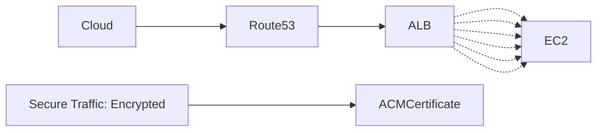
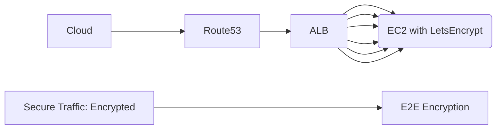

# Amazon Certificate Manager (ACM)

Provision, managage, and deploy public and private SSL /TLS certificates for use with AWS Services
ACM manages the complexirt nad manageinf public SSL/TLS certificates for your AWS based websites and pplicatiosns

ACM handles two kinds of certificates
1. Pblic - certificates provided by ACM (Free)
2. Private - certificaes you import ($400 per month)

ACM can handle multiple subdomains and wilcard domains (*)

exampro.co
*.examprod.co

ACM can be attaches to the following AWS resources:
- ELB (Elastic Load Balancer)
- CloudFront
- API Gateway
- Elastic Beanstalk (Through ELB)

ACM Example

### Attaching ACM Certificate to ALB using ACM
All traffic in-transit ebyonf the ALB is unencrypted - allows you to add as many EC2 instances to the ALB and you don't need to install certificates on each instnace. Theoreticaly less secure if someone hacked into your ACM

### Attaching individials LetsEncrypt cCrts to EC2 Instances
This is not ACM - Traffic is encrypted in transit all the way to the appl;ication - guarantess encryption end-tot-end, more complicated to maintain certifcates
This is more common wihth big corporations

