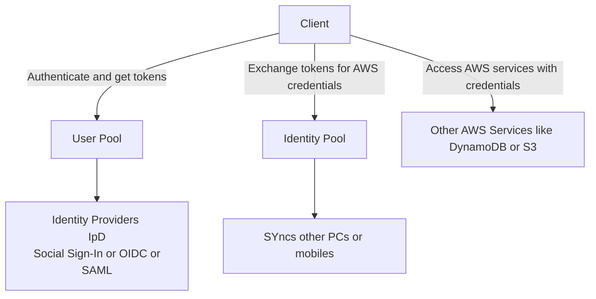

# Cognito

Amazon Cognito is a Decentralized Managed Authentication service
Think Sign-up, sign-in integration for apps using Facebook, Google IE Social Identity Provider

## Cognito User Pools
Cognito user pools are a user directory with authentication to Identity Providers (IpD) that grant access to your app

## Cognito Igentity Pools
Cognito Identity Pools provide temporary credentials for users to access AWS services

## Cognito Sync
Cognitory Sync alllows users to sync data nas preferncec across all devices

Web IDneiity Fedferation - eo exchange identity and security info between an IdP (idetity provider) and application

Identity Provider - trusted provider of your user iedneity lets you acuthitetcate to access other servicces- Identitry Providers are Googlie, GitHub, Linkedin GFacebook, Amazon, Twitter
Identity Providers are powered by either OAUTH (using the OpenID Connect OIDC protocol)
OAUTH is commonlt used for Web Identity FDederation

Alternatively can use Single Sign On (SSO) which is commonly implemented uisng SAML (Security Assertion Markup Language)

## Cognito User Pools
User Directory with authentication to IpD (Identity Providers) that grant access to app
Basccially a standard aadtabase of directories for Sign Up, Sign In, Account recorvery, and Account Confirmation
- Allows users to sign in deircely to the user pool, or using Web Identiy DFefderation
- Uses AWS Cognitor as the idetity borker bwtween AWS and IpD
- Successfuly user authetncatioa generates a JWT (json web otken)
User pools can be thought of the as the account used to access the system IE email address and password
- Persisted using JWT (json web token)

Cognito User Pools allow you to set choos ewhich attbiutes and set password requirements, apply MFA, restrict user access via adminverification, and set up analytics using PinPoint (think Mail chinp) for user campaigns

Key: This is a way to decentralize your user authenticatoi

## Cognito Identity Pools
Provides AWS credentials to access services
Identity can be though of as the acutal mechanism authorizing access to AWS reousrces

IE, ig you want an application to access S3 or Dynamo DB you need a Cognito Identiyy Pool not a User Pool becasue this is TEMPORARY access

Select a Provider (Cognirot or any), or allow unauthenticated identityies

Download the SDK

## COfnitot Sync
Lets you sycn user data and preferneces across devices across code

Uses push synchtonaztion to push updates and synchronzie data
Uses SNS under the hood

