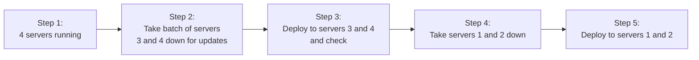
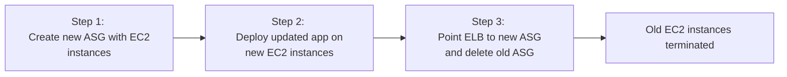

# Elastic Beanstalk (EB)

Platform as a Service - choose a platform, upload your code, it deploys

Develop, Run and manage applications without the complexity of building and maintaining infrastructure typically associated with developing and launching an app

AKA the Heroku for AWS

CloudFormation templates:
- Elastic Load Balancer
- Autoscaling Groups
- RDS Database
- EC2 Instance (Go, Python, etc)
- Monitoring (CloudWatch, SNS)
- IN-Place and Blue/Green Deployment
- Security - Rotates Passwords
- Can run Dockerized Environemnts

https://eu-central-1.console.aws.amazon.com/elasticbeanstalk/home?region=eu-central-1#/create-environment

Configuring enviornmen

Web Server Enviornment
- Creates an ESG
- Created an ELB
-
Work Environment
- Creates an ASG
- Creates an SQS Queue
- Installs the Sqsd daemon on the EC2 Instances
- Creates CloudWatch Alarm to dynamically scale einstances based on heatlh

Elastic Beanstalk
All at once - Load Balanced and Single Instance:
- Deploys all servers (instances) at once
- hig hrisk, faste

EB Rolling
Deploys blocks of servers at once: IE, if you have 4 servers,

Rolling taes batch instances out of service while deploymenyt occurs

Rolling
Immutable  - Load Balanced and Single Instance

Rolling with Additional Batch
Spin up new servers- rever reduce is a reduction of capaciy
start with 4 servers
spen up 2 new ones
apply updates to two new ones
if it successed, close out 2 original

Good for cases when reduction of caapacity could cause vailability ieses for users

Immutable
Safest way to deploy critical applications

1. Create a new Auto Scaling Group with EC2 instances
2. Deploy the upadtred ceriosn of the app on the new EC2 instances
3. Point hte ELB to the new ASH and delete the old ASG which will terminatied the old EC2 instances

Method   Impact of Failed Deployment    Deploy Time    No downtime    No DNS Change     Rollback Porcess   Code Deployed to Instances

All at once    Downtime    1     Downtime    No DNS Change    Manual    Existing
Rolling     Single batch out of service, any successful batches before fialure running new application version      D2 No downtime,  no DNS change   manual Exisitng
TRolling with asddiontla