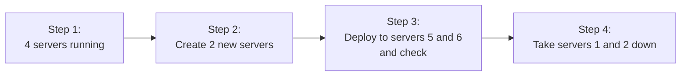

# Elastic Beanstalk (EB)

Platform as a Service - choose a platform, upload your code, it deploys

Develop, Run and manage applications without the complexity of building and maintaining infrastructure typically associated with developing and launching an app

AKA the Heroku for AWS

CloudFormation templates:

- Elastic Load Balancer
- Autoscaling Groups
- RDS Database
- EC2 Instance (Go, Python, etc)
- Monitoring (CloudWatch, SNS)
- IN-Place and Blue/Green Deployment
- Security - Rotates Passwords
- Can run Dockerized Environemnts

<https://eu-central-1.console.aws.amazon.com/elasticbeanstalk/home?region=eu-central-1#/create-environment>

Configuring enviornmen

Web Server Enviornment

- Creates an ESG
- Created an ELB
-

Work Environment

- Creates an ASG
- Creates an SQS Queue
- Installs the Sqsd daemon on the EC2 Instances
- Creates CloudWatch Alarm to dynamically scale einstances based on heatlh

## Elastic Beanstalk Deployment Policies

### All at once

- Load Balanced and Single Instance:
- Deploys all servers (instances) at once
- high risk, fastest

### Rolling

Deploys blocks of servers at once: IE, if you have 4 servers,


Rolling taes batch instances out of service while deploymenyt occurs

Rolling
Immutable  - Load Balanced and Single Instance

### Rolling with Additional Batch

Spin up new server - never reduce capaciy



Good for cases when reduction of capacity could cause availability issues for users

### Immutable

Safest way to deploy critical applications

1. Create a new Auto Scaling Group with EC2 instances
2. Deploy the upadtred ceriosn of the app on the new EC2 instances
3. Point hte ELB to the new ASH and delete the old ASG which will terminatied the old EC2 instances


Method   Impact of Failed Deployment    Deploy Time    No downtime    No DNS Change     Rollback Porcess   Code Deployed to Instances

All at once    Downtime    1     Downtime    No DNS Change    Manual    Existing
Rolling     Single batch out of service, any successful batches before fialure running new application version      D2 No downtime,  no DNS change   manual Exisitng
TRolling with asddiontla

Blue Green:

- minimal impact of failed deployment
- Deploy time = x4
- No Downtime
- Requires DNS change (DNS changes have to propagate to servers around the world - can be pointing to the old version, some users can experience unavailability)
- Rollback process = swap URL

## In-Place vs Blue/Green Deployment

Not definitive in definitoni

Elastic Beanstalk by default performs in-place updates

In-Place for Scope of Elastic Beanstalk Env
All deployment policies provided by EB could be considered In-Place since they are within the scope of a single EB environment
IE: All at once, Rolling, Rolling with Additional Batch, Immutable
In-Place could mean within the same Server (not replacing the server) - All at once, Rolling

- In-Place could also mean within the scope of an uninterrupted server - Traffic is never routed away from the server - Zero downtime deploys here Blue/Green occurs on the server
- EB can't do uninterrupted server - Capistrano + Ruby on Rails + Unicorn is the famous case of this method of deployment - lose agility but tradeoffs

Generally In-Place is in reference to Elastic Beanstalk

In-Place processes require the database get deleted

## In-Place vs Blue/Green

Immutable Deployment strategy is still considered In-Place becasue within the context of Elastic Beanstalk, the swap is happening within the Environment (even though swapping ASG is considered blue green deployment strategy)

Blue-Green Deploy (can be facilitated at the DNS level by Route 53) - involves switching entire Environments

Blue Green would allow DB to be the same (separate from Blue Green environemnts)


## Configuration Files

EB env can be customized using configs

Found in `.ebextensions` folder (hidden in root dir)
`.config` files

1. Option Settings for initial env
2. Linux/Windows Server config
3. Custum resources

Can adjust configs

## Env.yml

"Enviornment manifest" = `env.yml`

sets the defaults

```yml
AWSConfigureiotnTemplateVerrsion
EnvironmentName: exapro-prod+
SolutionStack: Ruby
EnvironmnetLinks
OptionSettings:
    aws:elb:loadbalancer
        CrossZone: true
```

## ELB Linux Server Configuration

Packages
 - download and install prepackaged applications and components


Groups
- create LINUX/UNIX groups and assign group IDs

Users
- create Linux/UNIX users

Files
- create files on the EC2 instance (inline or from URL)
-

Commands
- execute commands on the EC2 instance before the app is setup

```yml
commands
    1_project_root:
        command: mkdir /var/www/app
    2_link:
        command: ln -s /var/www/app /app
```

Services
Define which services should be started or stopped when the instance is launched

```yml
services:
    sysvinit:
        nginx:
            enabled: true
            ensureRunning: true
```

Container Commands

After server has been set up, these are any commands you want to run on it
Execute commands that affect your application source code
Not "DOcker" containers

```yml
container_commands:
    0_collect_static:
        command: "django-admin.py collectstatic --noinput"
    1_syncdb:
        command: "django-admin.py syndv --noinput"
        leader_only: true
    2_migrate:
        command: "django-admin.py migrate"
        leader_only: true
    3_customize:
        command: "scripts/customize.sh"
```

## EB - CLI

Install via:
git clone https://github.com/aws/aws-elastic-beanstalk-cli-setup.git ./aws-elastic-beanstalk-cli-setup/scripts/bundled_installer

```
eb init         configure project directory and the EB CLI
eb create       create first env
eb status       checks current status
eb health       view health, can also use --refresh every 10 seconds
eb events       see event output
eb logs         pull logs
eb open         open in browser
eb deploy       once nv is running deploys update
eb config       view config optoins
eb terminate    delete env to save money
```

## Custom Image

Can improve provisioning times
Can bake all the install packages into a custom image
Useful if youn eed to install a lot of software that is not included in the standard AMI

1. AWS Docs to identify the Application AMI
2. Use CLI `describe-platform-version`
3. Get the ImageId `ami-020sajd10fjsaf`
4. Go to EC2
5. Go to Sessions Manager
6. Create a New AMI
7. Go into config for applicaiotn and Update the Env to point to new AMI


## Configuring RDS

Database can either be inside or outside of EB Environment

Inside EB Env - intended for development envs, you create the database within EB, when EB Env is terminated, the database will also be terminated
(create an RDS daaabase as part of console commnds? - This will delete database)

Outside EB Env
1st Create RDS (outside EB ENV) - intended for production envs
You create databse separately
When env is terminated, databae will remain
Generalyl Blue Green Deployment

## Overview Cheatsheet

Elastic Beanstalk handles the deployment, from capacity provisioning, load balancing, auto-scaling to applicatio health monitoring
Useful when you want to run a web application but you don't want to think about the underlying infrastructure
It costs nothing to use Elastic Beanstalk - only resources it provisions (IE, RDS, ELB EC2)
Recommended for test or development apps - not for produciton use
Can use preconfigured platforms - Java, .NET, PHP, NOde, Python, Go, Docker, Ruby
Can run contaienrs on EB either in Sinlge Caonainter or Multi-Container - these are containers are running on ECS instead of EC2
Can launch either a Web Environmnet or a Worker Environment
- Web Environmnet
  - Single Instance Env: laundes a single EC2 instance, an EIP is assigned to the EC2
  - Load Balanced ENV: launch EC2s behind and ELB managed by an ASG
- Worker Environment
  - creates an SQS queue, install SQS daemon on the EC2 instances, and has ASG scaling policy which will add or remove instances based on quue size
Deployment Policies
- All at Once: takes all servers out at once, applies changes, puts servers back --- Fast, has downtime
- Rolling: updates servers in batches - reduced capacity based on batch size
- Rolling with Additonal Batch adds new sever n batches to repalce old, never reduces capacity
- Immutable: creates the same amount of servers, switches all at once to new servers, revmoving old servers

Rolling deployment policies require an ELB so cannot be used with Single-Instance Web Enviornments
In-Place deployment occurs wihin the environmnte, all deployment policies are in-place
Blue/Gree nis when deployment swaps environments (outside an environment). WHen you have external resources such as RDS which cannot be destroyed, this is suioted for Blue/Green
`.ebextensiosn` is a hidden folder which contains all confiuration files
With EB you can rpvoeide a custom image which can improve provisioning times
If you let EB create the RDS instance that means ywhen you delete the env it will delete the DB, intended for testing
Dockerrun.aws.json is similar to a ECS Task Definitoin diles and defines multi containeir configuraiont