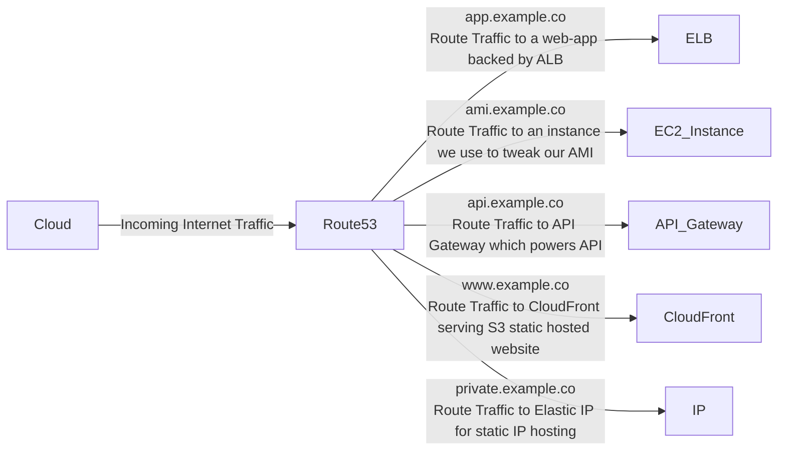

# Route 53

Route53 is a DNS (Domain Name Service)
Think like GoDaddy or NameCheap
But with more synergies with AWS Services

Route53 allows you to:

- register and manage domains
- create various records set on a domain
- Impl;eent compelx traffic flows, IE blue/gree ndeploy, failovoers

Failover is the process of switiching to a redundnant or standbsystem during the case of a dsiaruption to the primary system. Can be used to maintain high availabilir tof services by condfiguring additiona sl servers or sites in systems that can take over incase o f ailrs

- continuously monitor records via health checks
- resolve VPCs outside of AWS

## Use Cases

You can use Route53 to point custom domains to AWS reousrces

## Record Sets

We can create Record Sets which alllow pointing naked domain `example.co` and subdomains via Domain records

Record Set for "A" makes a  IIPv4 address

Setting an "Alias" for a record set allows you to sleect from avaialble AWS resoruces - will detect a change in IP address and continrously keep that endpoint pointed to correct resource
In most cases you want tob eusingf Alis when routing traffic to AWS resources
This is an extension of standard DNS functionality

## Routing Policies

This is the main advantage of using Route53

7 Types of Routing Policies in Route53
Simple Routing = defautl routing policy, multiple addresses result in random selection
Weighetd Routing - route traffic based on weighted values to split traffic
Latency-Based Routing - route traffic to region resources with lowest latency
Failover Routing - route traffic if primary endpoint is unhealhty to secondary endpoint
Geolocation Routing = rouete ttarfic basedo nl ocation f users
Geo-proximity Routing - route traffic based onlocaion ofd resources and optionally shift traggiv from resoruces in on location to resources in anohter
Multi-value Answer Routing - respond to DNS queieis with yp ti eught healhty records selcted at random

### Can use the Visual Editor

Supports versioning  so you can roll out or roll back updates

$50 per policy record per motnh

#### Simple Routing Polciies

- 1 record, and provide multiple IP addresses
- When multiple vlaues are speicifed, Route53 will reurn all values back to theuse in rando orer
- random sleciton - good for AB Testing

#### Weighted Routing Policies

- same as Simple but adds weights 85% and 15% etc, for example "Stable" and "Experimental" alows exprerimantl traffic

#### Latency Based Routing Polciies

- Toronto based client - > look at which IP provides the lowest latency (not necessarily gegogaphiclaly closest)

#### Failover Routing Polcieis

- monitors via health checks if endpoint of priamry is health, and id so all traffic isautomatically directed to secondary location
- primary and secondary web-app backed by ALB, can swtich from one to the other
-- Useful with active/passive setups in situatiosn where you wnat a pairmary site in one locaion and a seconadry data recover site in another

#### Geolocation Routing Policy

direct traffic based onrequest origin

#### Geoproximity Routing Policices

- must be created by Traffuic FLow (visual editor) not the recor sets
- GRP allow you to direct traffic baseed on the geogrpahic location of your users and your AWS resources
- Can route more or less traffic to a specific resource by sepcifying a Bias value
- Bias values expand or srhirnk the size of ht egrphgraphic region from which traggivc is rouited to
- Involes traffic map

#### MultiValue

This uses a health check
Same as Random - MultiValueAnswer Polcy adds a health check for record set resoruces

## Health Checks

- checks every 30 seconds by default, can configure to 10 seconds
- health check can inital a failover if status is returned unhealthy
- CloudWatch ALarm can be created to alert you of status unhealthy
- Health check can monitory other health checks to craet chain of reactions

Can create up to 50 health checks for AWS endponts within or linked to same AWS account

Basic health checks are 50c per health check per month

### Route53 Resolver
Formally known as .2 resolver
Regional service that lets you route DNS queries between your VPCs and your network
This is used to set up Hybrid networks
Basic configuration: Imbound and Outbound - Inbound Onlyo or Outboudn Only

## Final Review
Route53 is a a DNS Provider, Register and manage domains, similiar to GoDaddy or NameCheap
Simple Routing - Default Routing policy - multiple addresses in a random endpoint selection
Weighted Routing - split up traffic based on different weights assigned (Percentages)
Latency-Based Routing - Directs traffic based on region, for lowest possible latency for users
Failover Routing - primaty site in one location , secondaty data recoryver site in atother (changes on health check)
Geolocation TOuting - Oute trafi based on the geogrpahci location of a tequest origin
Geo-Prozimity Rouing - route trafgic basedo nthe georgrpahic location using Bias Valeus (Needs ROute 52 Trfaffci Flow)
Multi-Value ANswer Routing  Rrteutn mutliple values in respone to DNS queries (using Health checks)
Traffic Flow - visual Editor  for chainging reouting policies, can version policy records fro easy reollboack
AWS ALias Record - AWS smart DNS record, detects changes UPs for AWS resorces and adjusts automataiclly
Route53 Resolver - Lets you regionally route DNS queries between your VPCs and you network Hybrid Environments
Healtch checks can be cerated tom onitor and automatically over endpoints. You can have health chaecks monitro other health checks
