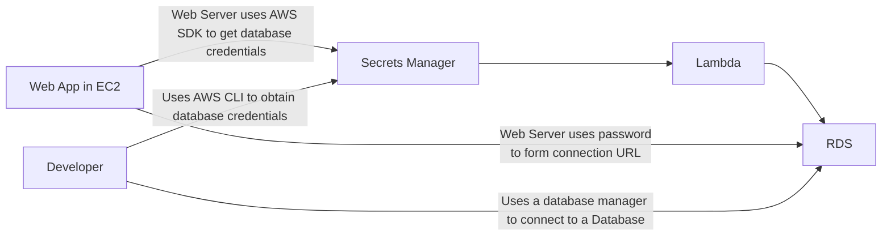

# Secrets Manager

Automatic Rotation = main benefitt for databse
rotate interaval
Creteaate Lambda fuction perfotm rotation
aws secretsmanager describe-0-secret --secret-id

get-secret-value

Stores password in RDS

