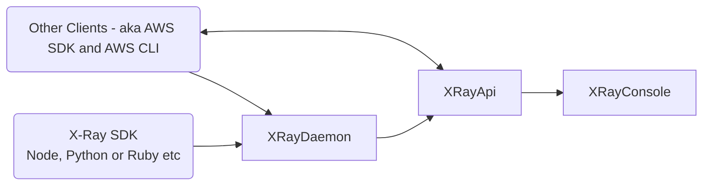

# X-Ray

## What is Micro-service architecture?

Small independent services that communicate over well-defined APIs

Serverless Storage
Container Tasks
Serverless Function
Databases
Notifications
Queueing
Streaming

Each service is owned by small, self-contained teams
Easier to scale and faster to develop, enabling innocation and acceleraring time-to-market
AWS: instead of using a large EC2, break it up into conainers or serverless functions

X-Ray is a "Distributed Tracing" service
- helps pinpoint failures (in a microservice acchitecture) and identify what causes poor performance
- "Where failures occur" and "What causes Poor Performance"

What is perforamnce monitoring?
Management ofd performance/availablilty of software apps
APM (Application Performance Monitoring) aims to detect performance problems in order to maintain expected levelo fs service

### 3rd Party Applications that are similiar to X-Ray
Cloud Monitoring - Applicaiton Performance Monitroing Services (APMs)
- Number one is DataDog (does log monitoring, APM)
- New Relic - application monitroing for large applications
- SignalFX - similiar to DataDog but more real time
- Lumigo - focused on serverless monitoring (similar to X-Ray)

### Distributed Tracing System
- Collects data about requests taht application serves
- View, filter collected data to identify issues and avenuses for oprtimization
- For any traced request, you can see all the calls made to other AWS Resources, HTTP Web APIS, microservices and Databases

## X-Ray
XRay Console - drill down into requests and
X-Ray API - sends requests (filtered) tp the Console
X-RAY Daemon - receives requests from application (a lot)
X-Ray SDK actually provides the segment data which is what we break down

X-Ray SDK provides
- interceptors to add to your code to trace incoming HTTP Requests
- Client handlers to instrument AWS SDK clients that application uses
- AN HTTP client to use to instrument calls to other internal and external HTTP web services
- A way to instrument calls into SQL Databases
- Automatic AWS SDK Client instrumentation

## XRay Instrumentation
Inside your applicatoin, add code to say `app.use(AWSXRay.express.openSegment('SegmentName'))` do some function then `closeSegment()`
Instrument is setting up the log points within the code: IE, the fine grain 'subsegments' that monitor products perfromance, diagnose errorsm or write trace information

## X-Ray Daemon
Receives requests - buffers the requests, then sends to the API
SDK sends JSON segment documetns to a Daemon process listening for UDP traffic (faster, less reliable)

This bakground process (daemon) buffers segments in a queue and uplaods them to X-Ray in batches

X-Ray uses trace data from AWS to create detailed service graph

## COre Concepts
Segments: AWS X-Ray receives data from services
X-Ray groups segments have a common request - combined into traces
Service Graph that provides a visual representation of the app

- Segments - If you have a bunch of resouces that use compute, you will need to send data about the work via "segments".
  - Segment can send the following info:
    - host: hostname, IP or alias
    - request: method, client address, path user agent
    - reponse: status or contnet
    - work done: start ad end times, subsegements
    - Issues: errors, faults, exceptions, automatic captruie of exception stacks
- Subsegments:
  - Provide granular timing info and details about downstream calls
    - Subsegement can contain adddiontal details boaut a call to AWS Service, external HHTTP API or SQL Database
    - Can define arbitraty subsegments to instrement specicifc lines of functions in applicatoin code
    - Generallyy , isnide of code you are not creating new Segements, only new subssegemts ithin the current segment
- Service Graph - shows the client , your frontend services, and backend servieces: Clients / (SNS - applicaiton integration, Lambda - copmpute,  - environment) / Backend (DynamoDB): helps identify bottlenecks - laetency sikes and other itsssus
- Traces: collects all segments generated by a single request
  - Trace ID tracks patjh of request through application
  - first supported serice that HTTP request interats with adds a Trace ID heade to request, and propagtes down - this tracks latency, disposition adn other request data
- Sampling: uses sampling algorithm to fdtermin which requests get rraced
  - By default the first SDK records the first request each second and 5%of all additional requests
  - Can modify the default sampling rule and add rules
  - This is doen to acoid esrvice charges when you are getring startedd, the default smapling rate is low
- Tracing Header
  - All requests are traced up to a minimum, after reaching a minimu, percetngate of remaining requess are traced to avoid eunnnessayr cost
  - Tracing Header is X-Amzn-Trace-ID: added by the first service on X-Ray, then if the request came from an instrumented alpplicaiton it can icnldue the Parent
- Filter Expressions
  - Lets you filter donw specific paths or users - for example goroup by
- Groups
  - Name agroup or ARN (Amazon Reousrce Number) to generate its own service gfaph, trace summaries nd Amazon
  - allows you oto create a a saved filter and have that appliy for nrw traces
  - CloudWartch metrics
- Annotations and Metadata
  - Can be added to segment/subsegemets documents
  - Annotations are indexed key-value paris for sue wih filter expreissois
  - X-ray allows indexed of 50 annotatioans per trace
  - Metadata key-value pairs are not indexed
  - Values can be any time includng objects and lists
  - Annotations used to record data you want to use to GROUP traces
  - Metatdata used to record adata to srore in trace but not in searching (non-indexed)
- Errors, Faults and Exceptions
  - XRay SDK records exception details and stack trace
  - Error: 40 0errors
  - Fault: 500 erros
  - Throttle: 429 too many requests (throottling)

XRay AWS Service Integration
Main use cases
- Lammbda
- API Gateway
- Elastic Load Balancer (ELB)
- Simples Notification Service (SNS)
- SImpel Suque Service (SQS)
- ECS

Sometimes aslso used
AppMesh
CloudTrail
CloudWatch
AWSConfig
EB
Amazon EC2
ECS Fargate

XRay Supported LNaugea
- Go
- NodeJs
- Ruby
- PHP
- Java
- Python
- ASP.NET

Review Cheat Sheet
- Xray helpds develepores analyze and debug applications that use microservice architatecture (great for micorservices)
- XRay is a Distributed Tracing System - used to progiel and monott apps, especially MOS. Pincpoint where srevices fail andf what causes poorp eroramcne
- X-Ray Daemon is a osfotware application hat listedn sfor traffic on UDP port 2000, fathers raw segment data and relays it oto AWS X-ray api. DFata is generally not sent deireclt ot X-RAy API an passes through the X-rya adaeomn which uplaods in bulk (creates buffer from API dar data being sent)
- Segments: provides reosurce names, details about the reques tand details work doen
- SUbsedments: privdes gabyalr timing indo and details fabout downstraems calls that make the full full the orignal erquest
- Serie Graph is a flow chart viaulizetion ifo average repsone for micrso sevices and to visually pintpiin fialurte
- TRaces clect all segments gfeneatred by a signle requst so you can trakc the path of request though mutiple serices
- Samping is an algorithm that decideswhich mrquests housld be traced. By default, X-ray SK recors the first request each second, and 5% of all additonal requsts
- Tacing hEafderi s named X-Amzn-Trace ID and idfneticies a tarace which assded long to downstrram sercvies
- Filter expressions allows uyou narwo downs peicfic paths or usesrs
- Groups allow save FIlterExpressions so you can quickly filter traces
- Annotiatas/MetatData: aalloss data for kye-value pairs
- ANotaion are incex for use tiwht filter expressions with limit of 50
- Metadata ois not inedexe - use metadat to recrod data you dont need to search
- Erros are 400
- Faults at4r 500
- Throttle is 429 Too Many RTequests
- Go, NodeJs, RubyJava, python ,APONET< Ruby,PHP
- XRay upport AWS Srevice Integrations with Lambda, EB, ACS, ECS Faragate, Simple Queue Ervice (SQS), EC2, Simple Notificaiotn Service (SNS), CLoudaThc, AppMesh, CLoudTrial , AWS Config, ELB, API Gateway